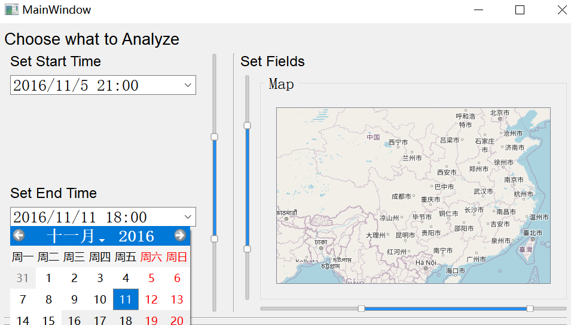

# RideHailingDataAnalyzer
🚖Analysis and Visualization of Online Ride-Hailing Order Data Project for PPPS

## Build Requirements
```
    Qt 5.15.2 MinGW 64
```
## Load Data from .csv Files
Set the path to the direction of the dataset.  
Click OK and wait.  
After a while, you will see the loading work done successfully.  


## Choosing Fields and Time Span to analyze
Time Span: support both calendar edit and slider.  
Fields: support sliders.


## Extern Library Used
[MapGraphics](https://github.com/raptorswing/MapGraphics) 