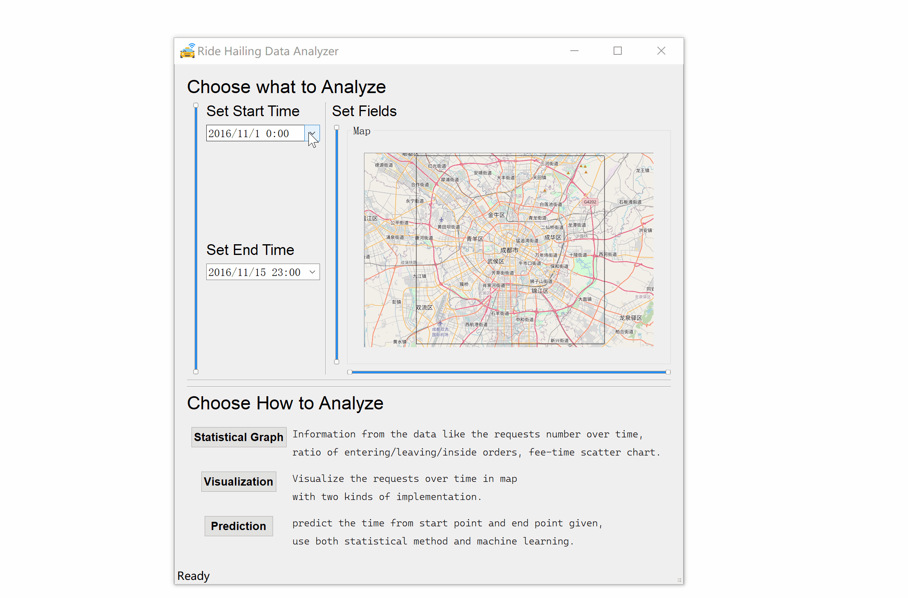

# RideHailingDataAnalyzer
🚖Analysis and Visualization of Online Ride-Hailing Order Data Project for PPPS

## Build Requirements
```shell
    Qt 5.15.2 MinGW 64
```
## Load Data from .csv Files

Set the path to the direction of the dataset.  
Click OK and wait.  
After a while, you will see the loading work done successfully.  


## Easy to Tune the Parameters
Time Span: support both calendar edit and slider.  
Fields: support sliders.


## Diverse Statistic Graphs
Three kinds of graphs:  
Number of Orders: get a quick view at the number of orders over time in a line chart.   
Orders percentage: display the percentage of orders leaving/entering/inside the area selected.  
Fee-Time scatter chat: diplay the distribution of both fee and time.


## Heat Map

Display the order in the map to show the distribution of the orders.  

heat map v1: scatter all the points to the map (running slow but contains more details).

heat map v2: count the number of points in every pixel of an image and transform it to colored heat map.(running faster than v1 to show the changes over time)


##  Travel Time Prediction

Predict the travel time from the given start point to the given end point.

Two methods are used to predict the travel time:

1. Find all the spatially and temporally related orders in the dataset, and get the average time of them as prediction.
2. Train deep neural network on the dataset and use the network to predict. Information about the network:
   1. Input:[departure_time,  weekday, orig_lon, orig_lat, orig_group, dest_lon, dest_lat, dest_group]
   2. Network: Eight Linear Layer with ReLU Layer in them.
   3. Output: [time]   


## Extern Library Used

[MapGraphics](https://github.com/raptorswing/MapGraphics) 